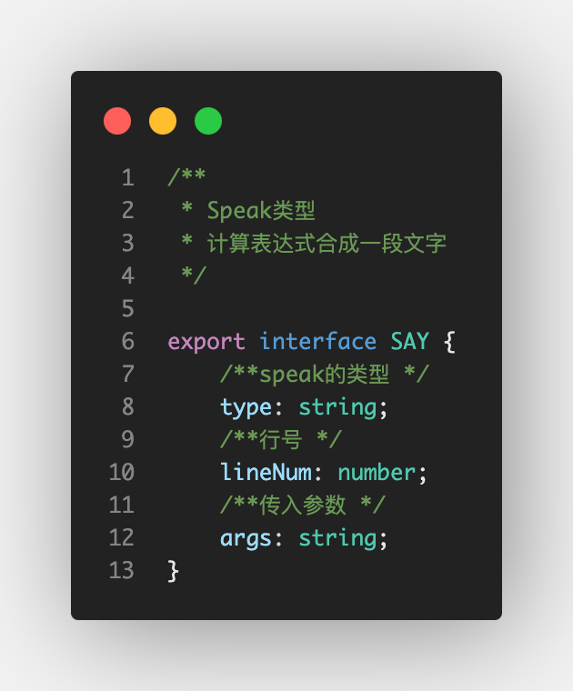
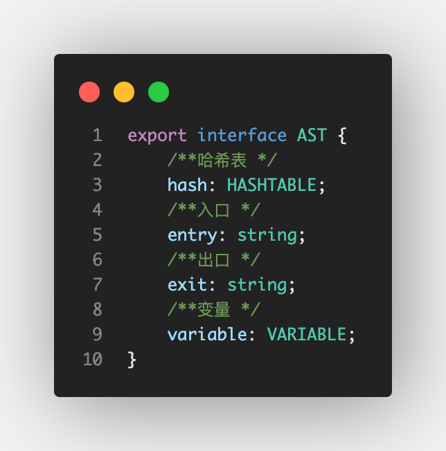
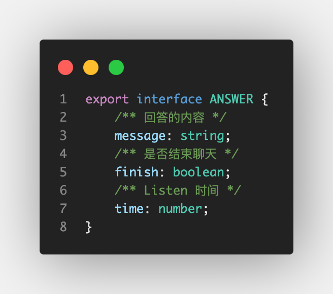
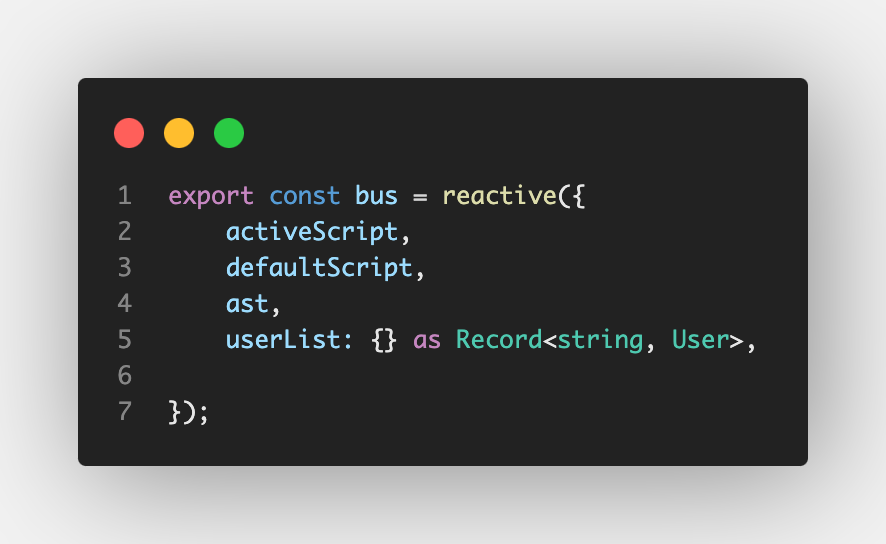
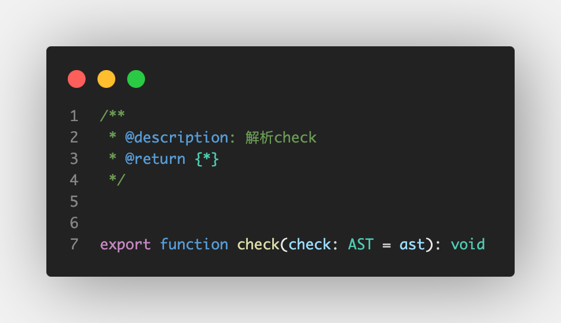
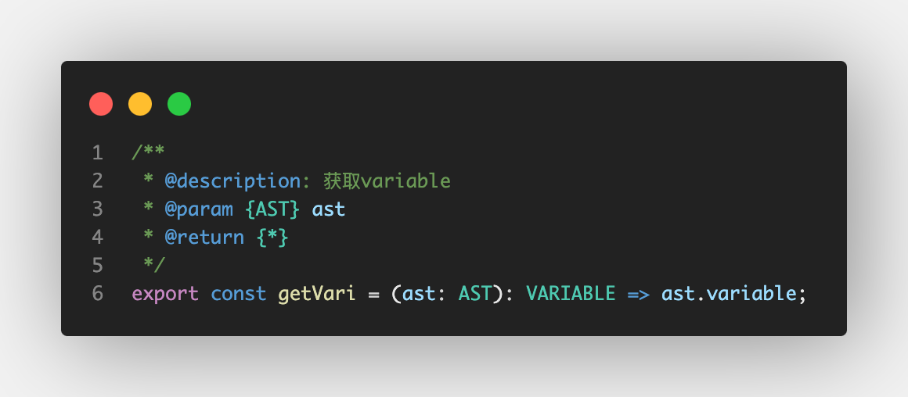
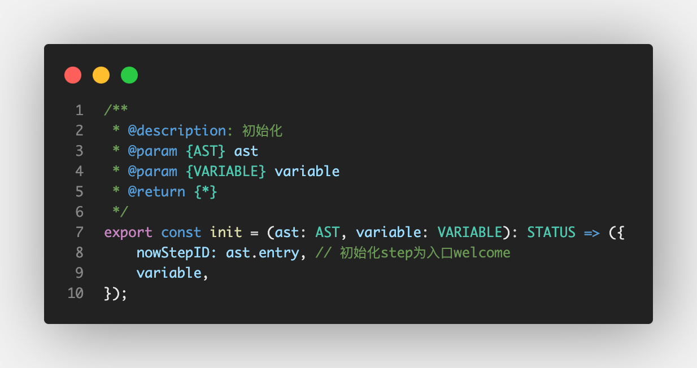
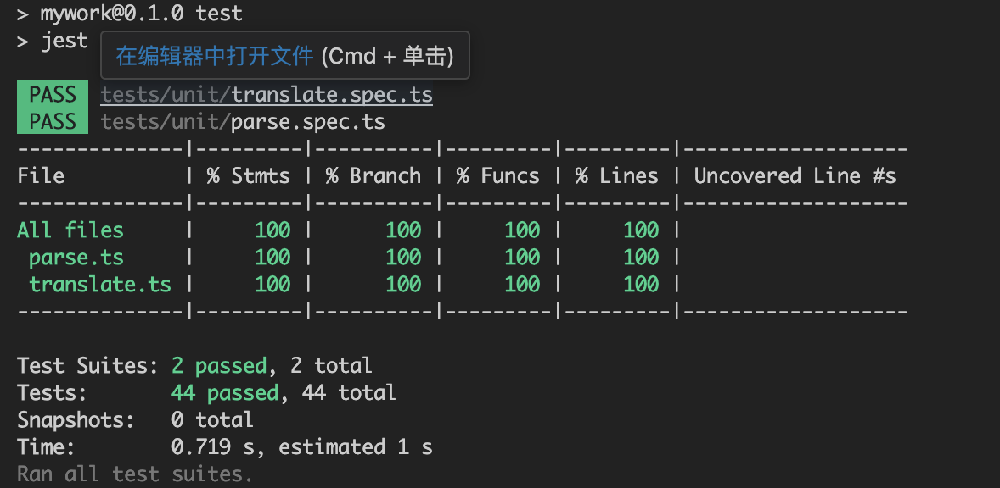

<a name="index">**目录**</a>
<a href="#0">题目描述:</a>  
&emsp;<a href="#1">描述:</a>  
&emsp;<a href="#2">基本要求:</a>  
&emsp;<a href="#3">扩展内容</a>  
<a href="#4">脚本设计</a>  
&emsp;<a href="#5">保留字</a>  
&emsp;<a href="#6">脚本语法</a>  
&emsp;<a href="#7">开发及测试环境:</a>  
&emsp;<a href="#8">设计思路:</a>  
&emsp;<a href="#9">设计模式与规范:</a>  
&emsp;<a href="#10">数据结构:</a>  
&emsp;<a href="#11">模块划分:</a>  
&emsp;&emsp;<a href="#12">前端:</a>  
&emsp;&emsp;<a href="#13">后端:</a>  
&emsp;<a href="#14">核心函数</a>  
&emsp;<a href="#15">测试桩与测试脚本:</a>  
&emsp;<a href="#16">效果展示:</a>  
<!--
 * @Author: hvinci
 * @Date: 2023-11-19 22:24:02
 * @LastEditors: hvinci
 * @LastEditTime: 2023-11-19 23:37:55
 * @Description: 
 * 
 * Copyright (c) 2023 by ${git_name_email}, All Rights Reserved. 
-->
# <a name="0">题目描述:</a><a style="float:right;text-decoration:none;" href="#index">[Top]</a>
## <a name="1">描述:</a><a style="float:right;text-decoration:none;" href="#index">[Top]</a>
领域特定语言（Domain Specific Language，DSL）可以提供一种相对简单的文法，用于特定领域的业务流程
定制。本作业要求定义一个领域特定脚本语言，这个语言能够描述在线客服机器人（机器人客服是目前提升客服效率
的重要技术，在银行、通信和商务等领域的复杂信息系统中有广泛的应用）的自动应答逻辑，并设计实现一个解释器
解释执行这个脚本，可以根据用户的不同输入，根据脚本的逻辑设计给出相应的应答。

## <a name="2">基本要求:</a><a style="float:right;text-decoration:none;" href="#index">[Top]</a>
1. 脚本语言的语法可以自由定义，只要语义上满足描述客服机器人自动应答逻辑的要求。
2. 程序输入输出形式不限，可以简化为纯命令行界面。
3. 应该给出几种不同的脚本范例，对不同脚本范例解释器执行之后会有不同的行为表现。

## <a name="3">扩展内容</a><a style="float:right;text-decoration:none;" href="#index">[Top]</a>
1. 扩展了脚本文法，允许用户进行变量计算；
2. 实现了语法检查；
3. 实现了脚本错误类型显示，精确到某一行；
4. 实现了多用户同时咨询，实时切换环境；
5. 实现了精良的用户交互体验，直观简洁。

# <a name="4">脚本设计</a><a style="float:right;text-decoration:none;" href="#index">[Top]</a>

## <a name="5">保留字</a><a style="float:right;text-decoration:none;" href="#index">[Top]</a>
- Say
- Listen
- Default
- Silence
- Branch
- Calculate
- Exit
- Step

## <a name="6">脚本语法</a><a style="float:right;text-decoration:none;" href="#index">[Top]</a>

**Step 的定义:**
1. 脚本分为多个 Step；
2. 每一个 Step 的第一行需要以 Step 开头，其后跟一个空格和自定义的 stepNames 用于唯一标识 Step；
3. 每一个 Step 的中间不能出现以 Step 开头的行，否则会视为两个 Step；

**注释:**
   - 注释使用 `#` 符号表示，用于提供有关代码的额外信息。在执行过程中，注释将被忽略。

**变量:**
   - 变量通过 `$` 符号标识，例如 `$name`、`$account`。这些变量似乎用于存储和检索用户的信息。

**字符串和插值:**
   - 字符串使用反引号包裹（例如，`` `这是一个字符串` ``）。
   - 插值（例如，`$name`）用于在字符串中引用变量的值。
  
**语句的定义:**
1. branch:
   - `branch` 语句用于根据用户输入跳转到不同的步骤。

2. Calculate:
   - `Calculate` 语句用于执行计算，例如 `$account - INPUT`。

3. listenTimeout:
   - `listenTimeout` 用于等待用户输入，并设置超时时间。

4. exit:
   - `exit` 语句表示结束对话。
  
5. say:
   - `say` 语句表示在该 Step 被执行时发送消息，在空格后跟随一个字符

6. silence:
   - `silence` 语句表示在用户沉默时跳转，参数为跳转到的 Step 的 id

7. default:
   - `default` 语句的作用是在以上规则都无法指定下一个 Step 时的默认 Step

**规定:**
1. 每一个脚本中至少需要有一个 Step 和一个含有 Exit 语句的 Step；
2. 每一个不含有 Exit 语句的 Step 中都需要有 Default 语句；
3. 每一个 stepNames 都需要在脚本中被定义；

## <a name="7">开发及测试环境:</a><a style="float:right;text-decoration:none;" href="#index">[Top]</a>

1. 系统：MacOS 14.1.1 (23B81)
2. 开发语言：TypeScript，HTML，CSS, Vue
3. 开发工具：Visual studio code 1.84.2，@vue/cli 5.0.8，yarn v1.22.19，Git
4. 开发框架：Vue.js 3.0
5. 测试工具：vue-jest@3.0.7
6. 测试环境：Chrome 119.0.6045.159

## <a name="8">设计思路:</a><a style="float:right;text-decoration:none;" href="#index">[Top]</a>

这项目允许用户在网页中实时编辑和执行脚本。同时，提供了聊天框，用户可以直接进行对话。还支持模拟多用户同时咨询的场景。
在脚本运行方面，项目参考了PPT的实现方式并进行了优化。首先，将脚本语言解析为语法树，这有助于确保代码的正确性和执行的稳定性。通过这种方式，可以更有效地处理脚本，提高整体性能。

## <a name="9">设计模式与规范:</a><a style="float:right;text-decoration:none;" href="#index">[Top]</a>
1. 本项目采用了拥有类型的Javascript，即TypeScript，作为开发语言。这一选择旨在确保程序的正确性，同时兼顾了JavaScript敏捷开发的优势。相较于JavaScript的弱类型特性可能导致的错误，TypeScript通过引入类型系统来提高代码的稳定性和可维护性。
2. 本项目注释详尽，对于关键变量和关键步骤均有描述


3. 本项目使用 Jest 作为测试框架，使用单元测试的模式对于程序编写了自动化测试脚本，并且对于每一个单元，可以模拟其他单元的正确输出进行测试，即测试桩。通过 Jest 进行单元测试，我们能够系统地验证代码的各个组成部分，确保它们在各种情境下都能正常运行。单元测试的模式允许我们隔离各个单元，通过测试桩模拟其他单元的输出，从而保证每个单元的功能独立正确。这种测试方法有助于捕捉潜在的bug，并在开发过程中提供快速反馈。同时，它提高了代码的可维护性，因为在进行修改或添加新功能时，开发人员可以确保不会破坏现有的功能。
4. 本项目的自动测试脚本覆盖全面，情况考虑完全，共有 2 个测试项目，36 个测试点对 parse 和 translate 两个关键算法进行测试，语句覆盖率、分支覆盖率、函数覆盖率和行覆盖率均达到了 100%，并且测试通过。


## <a name="10">数据结构:</a><a style="float:right;text-decoration:none;" href="#index">[Top]</a>

- SAY: say类型
  
包括:
1. type:say中内容的数据类型
2. lineNum:该say语句所在的行数
3. args:传入的参数,也就是say的内容

- LISTEN: listen类型
  
包括:
1. limit:等待时间的长短
2. lineNum:该listen语句所在的行数

- BRANCH: branch类型

包括:
1. answer: 用户的回答,对该回答进行不同的分支处理
2. stepID: 对用户的回答跳转到相应的step的名称
3. lineNum:该branch语句所在的行数

- SLIENCE: silence类型

包括:
1. stepID: 当用户保持沉默时,应该跳转到的stepID,也就是对应的silence
2. lineNum:该silence语句所在的行数

- DEFAULT: default类型

包括:
1. stepID: 当无法处理用户的回答时,应该跳转到的stepID,也就是对应的default
2. lineNum:该silence语句所在的行数

- HASHTABLE:哈希表

该哈希表中可以含有的变量为:
SAY、LISTEN、DEFAULT、SILENCE、BRANCH、line...

- AST: 语法树

包括
1. hash:哈希表
2. entry:语法树的入口
3. exit:语法书的出口
4. variable:用户输入的变量信息

- ANSWER:回答类型
  
包括:
1. message:回复的内容
2. finish:聊天是否结束
3. time:等待回复的时间

- STATUS: 当前状态
   
包括:
1. nowStepID:目前所在的step的名称
2. variable: 用户输入的变量
   
- MESSAGE:消息类型

包括:
1. author:发送消息的作者
2. type:消息类型
3. data:消息内容

- BUS:总线:时刻观察这些变量的变化

1. 当前应用的脚本
2. 默认脚本
3. 语法树
4. 用户列表

## <a name="11">模块划分:</a><a style="float:right;text-decoration:none;" href="#index">[Top]</a>

### <a name="12">前端:</a><a style="float:right;text-decoration:none;" href="#index">[Top]</a>
1. Botton.vue:
编辑器和编辑器相关按钮的模块，可以可视化的编辑脚本和应用
2. ChatBox.vue:
用户与客服聊天模块
3. TechTime.vue:
时钟模块
4. UserList.vue:
用户列表模块
### <a name="13">后端:</a><a style="float:right;text-decoration:none;" href="#index">[Top]</a>
1. bus.ts:
总线模块，用于存储一些全局信息，便于在组件间共用
2. defaultScript.ts:
默认脚本信息
3. interface.ts:
接口模块:是类型定义模块，用于规定和注释自定义的类型，便于编码时使用。
4. parse.ts:
解析模块:将脚本解析为语法树
5. translate.ts:
执行脚本的模块，将语法树和当前状态传进去，获得回复和更新状态

## <a name="14">核心函数</a><a style="float:right;text-decoration:none;" href="#index">[Top]</a>
1. parse(script: string): AST

传入参数::script脚本
功能:将脚本解析为语法树
return::语法树

2. check(check: AST = ast): void 

传入参数:构建好的语法树
功能:验证构建的语法树是否正确

3.  getVari = (ast: AST): VARIABLE

功能:获取用户输入的变量以供语法树使用
return:变量的值与名称

4. export const init = (ast: AST, variable: VARIABLE): STATUS

传入参数:语法树、变量
return:初始步骤与变量

5. export function translate

传入参数:语法树、状态、用户回复、是否为入口、是否silence
功能: 执行脚本,更新状态
return :客服的回应

## <a name="15">测试桩与测试脚本:</a><a style="float:right;text-decoration:none;" href="#index">[Top]</a>
本项目使用 Jest 测试框架，对于 parse 和 translate 两个模块进行单元测试，总共设计了44个测试项目,覆盖了所有的语句、分支、函数和代码行，保证了测试的正确性和完备性。

在测试阶段，Jest框架发挥了测试桩的关键作用，能够模拟生成AST语法树和用户输入。这使得我们能够独立地对parse和translate两个模块进行单元测试，而无需考虑它们之间的相互依赖关系。

Jest的测试脚本具有高度自动化，只需运行 `npm run test` 命令即可触发自动化测试流程，并在完成后输出详细的测试结果。这为开发人员提供了便捷的方式来验证代码的正确性，同时节省了手动测试的时间和精力。

通过Jest的测试桩功能，我们能够模拟各种场景，包括生成AST和用户输入的不同情况，以确保代码在各种情境下都能正确执行。这种测试方法有助于发现潜在的问题并提高代码的质量。



## <a name="16">效果展示:</a><a style="float:right;text-decoration:none;" href="#index">[Top]</a>

- 网页主页面:


- 点击apply:应用当前输入框/用户恢复默认的脚本
- 点击reset:重置脚本为默认脚本
  
- 点击upload:用户可以自己上传脚本
  


- 点击Script Structure


- 点击download:用户可以下载当前生效的脚本
  


- 点击开启聊天:
- - 用户可以输入姓名


- - 此时用户列表部分会显示用户姓名,用户姓名不可以重复使用


- 用户输入姓名以及账户余额供脚本使用


- 此时用户可以与客服对话:


- 我选用的默认脚本是:
```test
step welcome 
    say $name+"您好！欢迎光临瑞幸咖啡！我是您的智能咖啡助手。有什么可以帮助您的吗?"
    listenTimeout 5
    branch "查询咖啡种类和价格", productQuery
    branch "下订单", placeOrder
    branch "查询订单状态", orderStatusQuery
    branch "店铺信息", storeInfo
    branch "投诉与建议", feedback
    branch "常见问题解答", faq
    branch "退出", exit
    silenceAction silence
    defaultAction default
    
step productQuery 
    say "想了解我们的咖啡种类和价格吗？我们提供的咖啡有: 马斯卡彭生酪拿铁 18元/杯、生椰拿铁 18元/杯、酱香拿铁 19元/杯、圣诞烤布丁拿铁 21元/杯、太妃真香厚乳拿铁 19元/杯。"
    branch "了解更多", faq
    branch "我想下订单", placeOrder
    defaultAction default
step placeOrder 
    say "如果您想订购咖啡，只需告诉我您想要的产品的价格.我将为您计算您的账户余额.您当前的余额为:"+$account #comment
    Calculate $account,afterPlaceOrder,$account - INPUT #comment

step afterPlaceOrder 
    say "购买成功,您的账户余额为:"+ $account + "请问您还有什么需求吗?"
    listenTimeout 5
    branch "查询咖啡种类和价格", productQuery
    branch "下订单", placeOrder
    branch "查询订单状态", orderStatusQuery
    branch "店铺信息", storeInfo
    branch "投诉与建议", feedback
    branch "常见问题解答", faq
    branch "退出", exit
    silenceAction silence
    defaultAction default

step orderStatusQuery 
    say "您的订单正在制作中,请稍等"
    listenTimeout 5
    branch "查询咖啡种类和价格", productQuery
    branch "下订单", placeOrder
    branch "查询订单状态", orderStatusQuery
    branch "店铺信息", storeInfo
    branch "投诉与建议", feedback
    branch "常见问题解答", faq
    branch "退出", exit
    silenceAction silence
    defaultAction default

step storeInfo 
    say "需要了解附近店铺的位置和营业时间吗？告诉我您所在的城市，我会为您提供相关信息。"
    branch "瑞幸咖啡的营业时间是多久", businessHours
    defaultAction default

step businessHours
    say "瑞幸咖啡的营业时间可能因地区而异。通常，我们的店铺在早上8点至晚上10点之间营业。"
    listenTimeout 5
    branch "查询咖啡种类和价格", productQuery
    branch "下订单", placeOrder
    branch "查询订单状态", orderStatusQuery
    branch "店铺信息", storeInfo
    branch "投诉与建议", feedback
    branch "常见问题解答", faq
    branch "退出", exit
    silenceAction silence
    defaultAction default

step feedback 
    say "如果您有任何投诉或建议，我们非常重视。请告诉我您的问题，我将尽力帮助您或转接您至相关部门。"
    defaultAction feedbackFinish

step feedbackFinish
    say "好了，你的投诉已经牢牢地被我记在小本本上了。请问还有什么可以帮到您的?"
    listenTimeout 5
    branch "查询咖啡种类和价格", productQuery
    branch "下订单", placeOrder
    branch "查询订单状态", orderStatusQuery
    branch "店铺信息", storeInfo
    branch "投诉与建议", feedback
    branch "常见问题解答", faq
    branch "退出", exit
    silenceAction silence
    defaultAction default

step faq 
    say "有关账户、支付、配送等方面的常见问题，您可以直接问我，我会提供尽可能详细的解答。比如,您可以问我:如何创建账户、支付方式有哪些、配送服务说明"
    branch "如何创建账户", accountCreation
    branch "支付方式有哪些", paymentMethods
    branch "配送服务说明", deliveryDetails
    defaultAction default

step accountCreation
    say "要创建瑞幸咖啡账户，您可以访问我们的官方网站或使用我们的移动应用。在注册过程中，您需要提供一些基本信息，如电子邮件地址和密码。完成注册后，您就可以享受更多会员福利了。"
    listenTimeout 5
    branch "查询咖啡种类和价格", productQuery
    branch "下订单", placeOrder
    branch "查询订单状态", orderStatusQuery
    branch "店铺信息", storeInfo
    branch "投诉与建议", feedback
    branch "常见问题解答", faq
    branch "退出", exit
    silenceAction silence
    defaultAction default

step paymentMethods
    say "我们接受多种支付方式，包括信用卡、支付宝和微信支付。您可以在下单时选择最方便的支付方式完成交易。"
    listenTimeout 5
    branch "查询咖啡种类和价格", productQuery
    branch "下订单", placeOrder
    branch "查询订单状态", orderStatusQuery
    branch "店铺信息", storeInfo
    branch "投诉与建议", feedback
    branch "常见问题解答", faq
    branch "退出", exit
    silenceAction silence
    defaultAction default

step deliveryDetails
    say "我们提供快捷可靠的配送服务。配送时间和费用可能会根据您所在的地区而有所不同。在结账时，您可以查看详细的配送选项和费用信息。如果有特殊要求，请告诉我，我们将尽力满足您的需求。"
    branch "查询咖啡种类和价格", productQuery
    branch "下订单", placeOrder
    branch "查询订单状态", orderStatusQuery
    branch "店铺信息", storeInfo
    branch "投诉与建议", feedback
    branch "常见问题解答", faq
    branch "退出", exit
    silenceAction silence
    defaultAction default

step exit 
    say "感谢您选择瑞幸咖啡！再见。"
    exit

step silence 
    say "听不清，请您大声一点可以吗?"
    branch "查询咖啡种类和价格", productQuery
    branch "下订单", placeOrder
    branch "查询订单状态", orderStatusQuery
    branch "店铺信息", storeInfo
    branch "投诉与建议", feedback
    branch "常见问题解答", faq
    branch "退出", exit
    defaultAction default

step default 
    say "抱歉，我不明白你的意思."
    listenTimeout 5
    branch "查询咖啡种类和价格", productQuery
    branch "下订单", placeOrder
    branch "查询订单状态", orderStatusQuery
    branch "店铺信息", storeInfo
    branch "投诉与建议", feedback
    branch "常见问题解答", faq
    branch "退出", exit
    silenceAction silence
    defaultAction default
```
- 测试脚本对话部分:
  
  
  
  
  
  
  