<a name="index">**目录**</a>
<a href="#0">一. 题目描述</a>  
&emsp;<a href="#1">1. 描述</a>  
&emsp;<a href="#2">2. 基本要求</a>  
&emsp;<a href="#3">3. 扩展内容</a>  
<a href="#4">二. 脚本设计</a>  
&emsp;<a href="#5">1. 保留字</a>  
&emsp;<a href="#6">2. 脚本语法</a>  
<a href="#7">三. 开发及测试环境:</a>  
<a href="#8">四. 设计思路:</a>  
&emsp;<a href="#9">设计模式与规范:</a>  
<a href="#10">五. 数据结构:</a>  
&emsp;&emsp;<a href="#11">SAY: say类型</a>  
&emsp;&emsp;<a href="#12">LISTEN: listen类型</a>  
&emsp;&emsp;<a href="#13">BRANCH: branch类型</a>  
&emsp;&emsp;<a href="#14">SLIENCE: silence类型</a>  
&emsp;&emsp;<a href="#15">DEFAULT: default类型</a>  
&emsp;&emsp;<a href="#16">HASHTABLE:哈希表</a>  
&emsp;&emsp;<a href="#17">AST: 语法树</a>  
&emsp;&emsp;<a href="#18">ANSWER:回答类型</a>  
&emsp;&emsp;<a href="#19">STATUS: 当前状态</a>  
&emsp;&emsp;<a href="#20">MESSAGE:消息类型</a>  
&emsp;&emsp;<a href="#21">BUS:总线:时刻观察这些变量的变化</a>  
<a href="#22">六. 模块划分:</a>  
&emsp;<a href="#23">1. 前端:</a>  
&emsp;<a href="#24">2. 后端:</a>  
&emsp;<a href="#25">3. 核心部分及解析</a>  
&emsp;&emsp;<a href="#26">后端:</a>  
&emsp;&emsp;&emsp;<a href="#27">1. parse.ts</a>  
&emsp;&emsp;&emsp;<a href="#28">2. translate.ts</a>  
&emsp;&emsp;<a href="#29">前端:</a>  
&emsp;&emsp;&emsp;<a href="#30">1. 主界面: App.vue</a>  
&emsp;&emsp;&emsp;<a href="#31">2. 按钮组件: Button.vue</a>   
&emsp;&emsp;&emsp;<a href="#35">3. 聊天框部分: ChatBox.vue</a>   
&emsp;&emsp;&emsp;<a href="#40">4. 动态时间模块: TechTime.vue</a>  
&emsp;&emsp;&emsp;<a href="#45">5. 用户列表模块: UserList.vue</a>  
<a href="#49">七. 测试桩与测试脚本:</a>  
<a href="#50">八. 效果展示:</a>  
<!--
 * @Author: hvinci
 * @Date: 2023-11-19 22:24:02
 * @LastEditors: hvinci
 * @LastEditTime: 2023-11-20 22:56:18
 * @Description: 
 * 
 * Copyright (c) 2023 by ${git_name_email}, All Rights Reserved. 
-->
# <a name="0">一. 题目描述</a><a style="float:right;text-decoration:none;" href="#index">[Top]</a>
## <a name="1">1. 描述</a><a style="float:right;text-decoration:none;" href="#index">[Top]</a>
&emsp;领域特定语言（Domain Specific Language，DSL）可以提供一种相对简单的文法，用于特定领域的业务流程
定制。本作业要求定义一个领域特定脚本语言，这个语言能够描述在线客服机器人（机器人客服是目前提升客服效率
的重要技术，在银行、通信和商务等领域的复杂信息系统中有广泛的应用）的自动应答逻辑，并设计实现一个解释器
解释执行这个脚本，可以根据用户的不同输入，根据脚本的逻辑设计给出相应的应答。

## <a name="2">2. 基本要求</a><a style="float:right;text-decoration:none;" href="#index">[Top]</a>
1. 脚本语言的语法可以自由定义，只要语义上满足描述客服机器人自动应答逻辑的要求。
2. 程序输入输出形式不限，可以简化为纯命令行界面。
3. 应该给出几种不同的脚本范例，对不同脚本范例解释器执行之后会有不同的行为表现。

## <a name="3">3. 扩展内容</a><a style="float:right;text-decoration:none;" href="#index">[Top]</a>
1. 扩展了脚本文法，允许用户进行变量计算；
2. 实现了语法检查；
3. 实现了脚本错误类型显示，精确到某一行；
4. 实现了多用户同时咨询，实时切换环境；
5. 实现了精良的用户交互体验，直观简洁。

# <a name="4">二. 脚本设计</a><a style="float:right;text-decoration:none;" href="#index">[Top]</a>

## <a name="5">1. 保留字</a><a style="float:right;text-decoration:none;" href="#index">[Top]</a>

| Say       | Listen    | Default   | Silence   |
| --------- | --------- | --------- | --------- |
| Branch    | Calculate | Exit      | Step      |


## <a name="6">2. 脚本语法</a><a style="float:right;text-decoration:none;" href="#index">[Top]</a>

**Step 的定义:**
1. 脚本分为多个 Step；
2. 每一个 Step 的第一行需要以 Step 开头，其后跟一个空格和自定义的 stepNames 用于唯一标识 Step；
3. 每一个 Step 的中间不能出现以 Step 开头的行，否则会视为两个 Step；

**注释:**
   - 注释使用 `#` 符号表示，用于提供有关代码的额外信息。在执行过程中，注释将被忽略。

**变量:**
   - 变量通过 `$` 符号标识，例如 `$name`、`$account`。这些变量似乎用于存储和检索用户的信息。

**字符串和插值:**
   - 字符串使用反引号包裹（例如，`` `这是一个字符串` ``）。
   - 插值（例如，`$name`）用于在字符串中引用变量的值。
  
**语句的定义:**
1. branch:
   - `branch` 语句用于根据用户输入跳转到不同的步骤。

2. Calculate:
   - `Calculate` 语句用于执行计算，例如 `$account - INPUT`。

3. listenTimeout:
   - `listenTimeout` 用于等待用户输入，并设置超时时间。

4. exit:
   - `exit` 语句表示结束对话。
  
5. say:
   - `say` 语句表示在该 Step 被执行时发送消息，在空格后跟随一个字符

6. silence:
   - `silence` 语句表示在用户沉默时跳转，参数为跳转到的 Step 的 id

7. default:
   - `default` 语句的作用是在以上规则都无法指定下一个 Step 时的默认 Step

**规定:**
1. 每一个脚本中至少需要有一个 Step 和一个含有 Exit 语句的 Step；
2. 每一个不含有 Exit 语句的 Step 中都需要有 Default 语句；
3. 每一个 stepNames 都需要在脚本中被定义；

# <a name="7">三. 开发及测试环境:</a><a style="float:right;text-decoration:none;" href="#index">[Top]</a>

1. 系统：MacOS 14.1.1 (23B81)
2. 开发语言：TypeScript，HTML，CSS, Vue
3. 开发工具：Visual studio code 1.84.2，@vue/cli 5.0.8，yarn v1.22.19，Git
4. 开发框架：Vue.js 3.0
5. 测试工具：vue-jest@3.0.7
6. 测试环境：Chrome 119.0.6045.159

# <a name="8">四. 设计思路:</a><a style="float:right;text-decoration:none;" href="#index">[Top]</a>

&emsp;该项目允许用户在网页中实时编辑和执行脚本。同时，提供了聊天框，用户可以直接进行对话。还支持模拟多用户同时咨询的场景。
&emsp;在脚本运行方面，项目参考了PPT的实现方式并进行了优化。将脚本语言解析为语法树，通过前端用户的输入信息,根据对语法树的翻译来采取对应的响应.这有助于确保代码的正确性和执行的稳定性。通过这种方式，可以更有效地处理脚本，提高整体性能。

## <a name="9">设计模式与规范:</a><a style="float:right;text-decoration:none;" href="#index">[Top]</a>
1. 本项目采用了拥有类型的Javascript，即TypeScript，作为开发语言。这一选择旨在确保程序的正确性，同时兼顾了JavaScript敏捷开发的优势。相较于JavaScript的弱类型特性可能导致的错误，TypeScript通过引入类型系统来提高代码的稳定性和可维护性。
2. 本项目注释详尽，对于关键变量和关键步骤均有描述
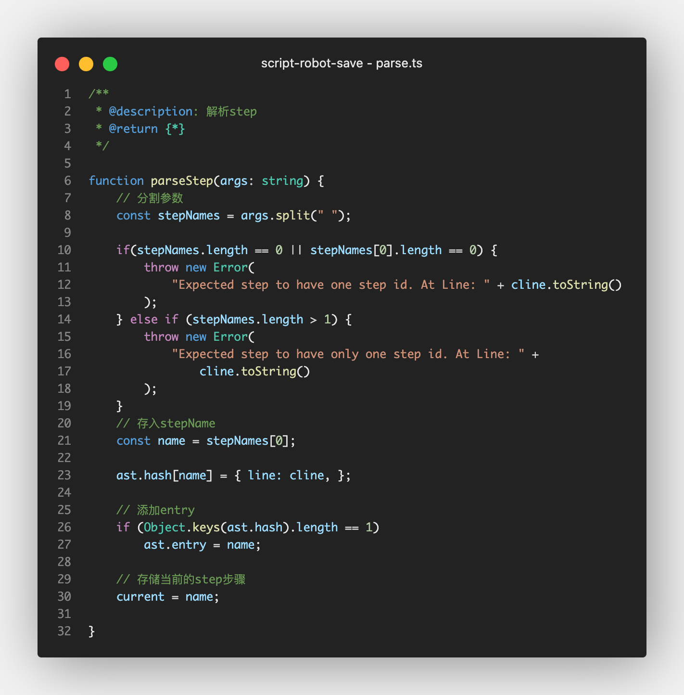
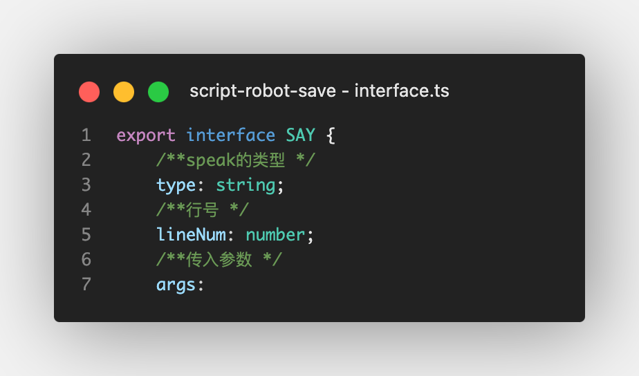
3. 本项目使用 Jest 作为测试框架，使用单元测试的模式对于程序编写了自动化测试脚本，并且对于每一个单元，可以模拟其他单元的正确输出进行测试，即测试桩。通过 Jest 进行单元测试，我们能够系统地验证代码的各个组成部分，确保它们在各种情境下都能正常运行。单元测试的模式允许我们隔离各个单元，通过测试桩模拟其他单元的输出，从而保证每个单元的function独立正确。这种测试方法有助于捕捉潜在的bug，并在开发过程中提供快速反馈。同时，它提高了代码的可维护性，因为在进行修改或添加新function时，开发人员可以确保不会破坏现有的function。
4. 本项目的自动测试脚本覆盖全面，情况考虑完全，共有 2 个测试项目，40 个测试点对 parse 和 translate 两个关键算法进行测试，语句覆盖率、分支覆盖率、函数覆盖率和行覆盖率均达到了 100%，并且测试通过。
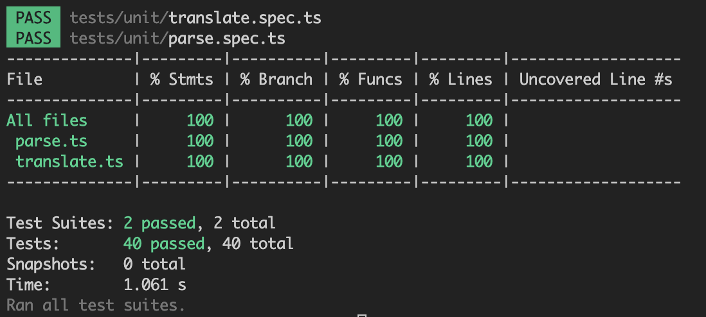

# <a name="10">五. 数据结构:</a><a style="float:right;text-decoration:none;" href="#index">[Top]</a>

### <a name="11">SAY: say类型</a><a style="float:right;text-decoration:none;" href="#index">[Top]</a>
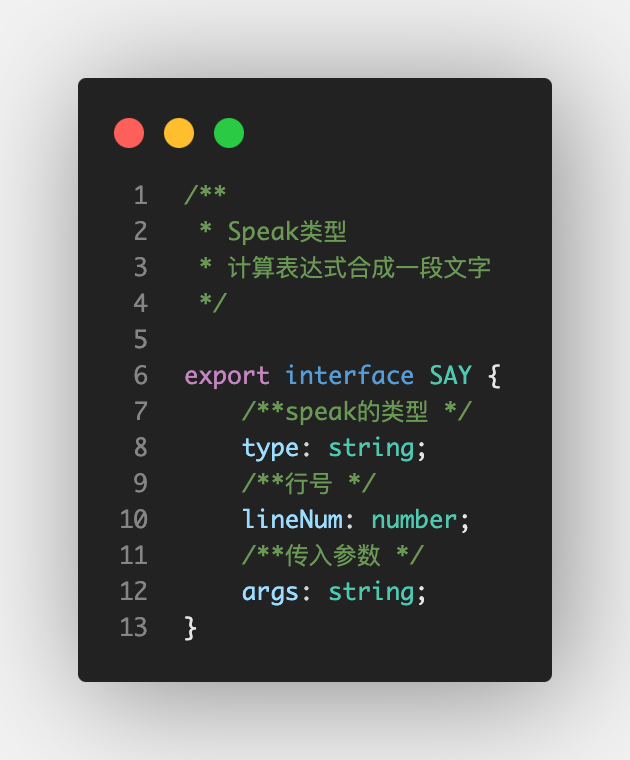

**包括:**
1. type: say中内容的数据类型
2. lineNum: 该say语句所在的行数
3. args: 传入的参数,也就是say的内容

### <a name="12">LISTEN: listen类型</a><a style="float:right;text-decoration:none;" href="#index">[Top]</a>


**包括:**
1. limit: 等待时间的长短
2. lineNum: 该listen语句所在的行数

### <a name="13">BRANCH: branch类型</a><a style="float:right;text-decoration:none;" href="#index">[Top]</a>
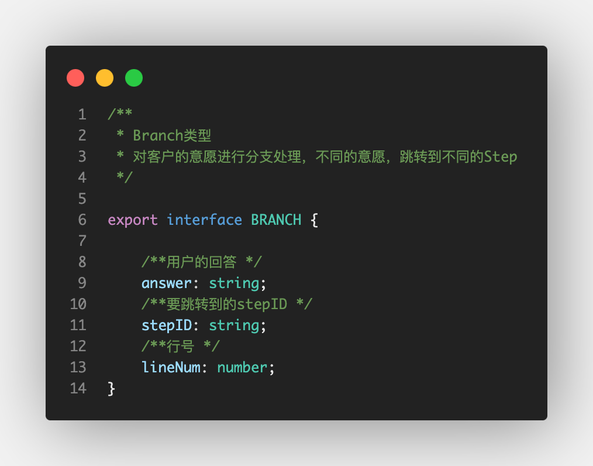

**包括:**
1. answer: 用户的回答,后续会对该回答进行不同的分支处理
2. stepID: 对用户的回答跳转到相应的step的名称
3. lineNum: 该branch语句所在的行数

### <a name="14">SLIENCE: silence类型</a><a style="float:right;text-decoration:none;" href="#index">[Top]</a>
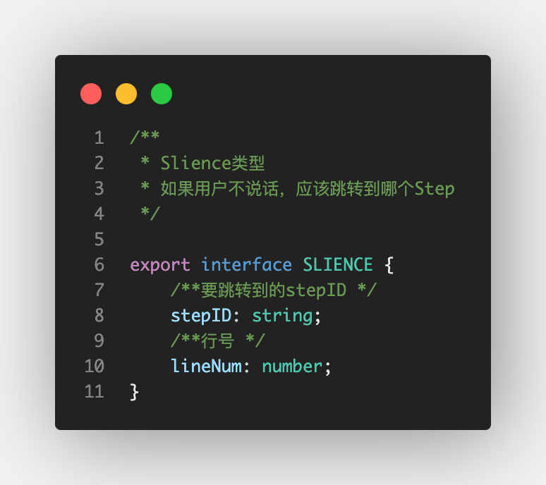

**包括:**
1. stepID: 当用户保持沉默时,应该跳转到的stepID,也就是对应的silence
2. lineNum: 该silence语句所在的行数

### <a name="15">DEFAULT: default类型</a><a style="float:right;text-decoration:none;" href="#index">[Top]</a>
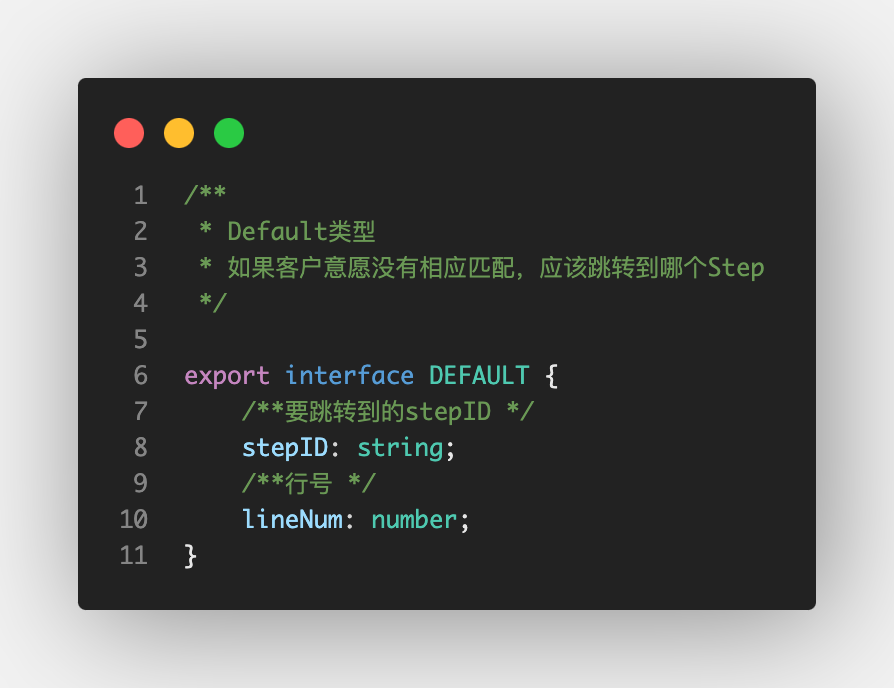

**包括:**
1. stepID: 当无法处理用户的回答时,应该跳转到的stepID,也就是对应的default
2. lineNum: 该silence语句所在的行数

### <a name="16">HASHTABLE:哈希表</a><a style="float:right;text-decoration:none;" href="#index">[Top]</a>


&emsp;该哈希表中可以含有的变量为: 
&emsp;SAY、LISTEN、DEFAULT、SILENCE、BRANCH、line...

### <a name="17">AST: 语法树</a><a style="float:right;text-decoration:none;" href="#index">[Top]</a>
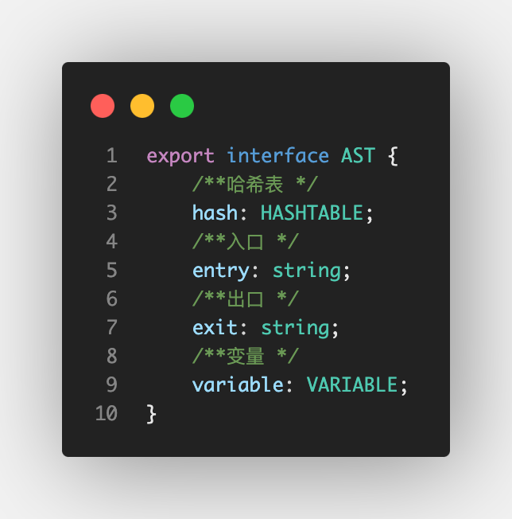

**包括:**
1. hash: 哈希表
2. entry: 语法树的入口
3. exit: 语法书的出口
4. variable: 用户输入的变量信息

### <a name="18">ANSWER:回答类型</a><a style="float:right;text-decoration:none;" href="#index">[Top]</a>
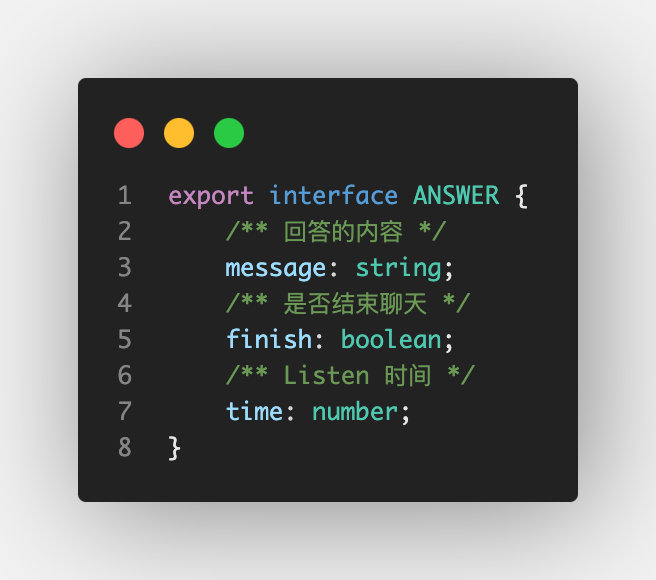

**包括:**
1. message: 回复的内容
2. finish: 聊天是否结束
3. time: 等待回复的时间

### <a name="19">STATUS: 当前状态</a><a style="float:right;text-decoration:none;" href="#index">[Top]</a>
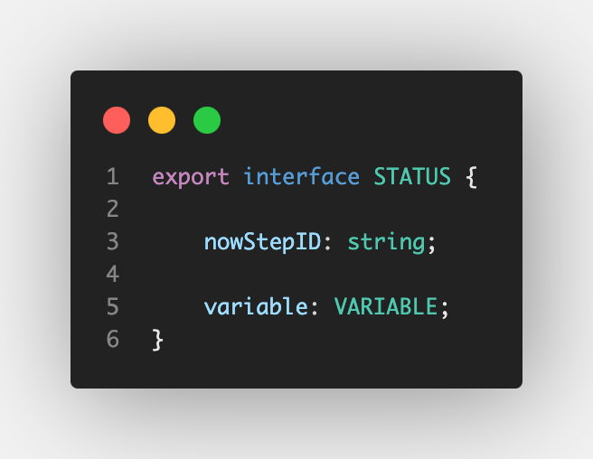 

**包括:**
1. nowStepID: 目前所在的step的名称
2. variable: 用户输入的变量

### <a name="20">MESSAGE:消息类型</a><a style="float:right;text-decoration:none;" href="#index">[Top]</a>


**包括:**
1. author: 发送消息的作者
2. type: 消息类型
3. data: 消息内容

### <a name="21">BUS:总线:时刻观察这些变量的变化</a><a style="float:right;text-decoration:none;" href="#index">[Top]</a>
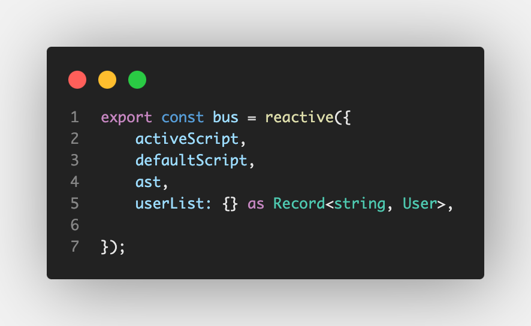

1. 当前应用的脚本
2. 默认脚本
3. 语法树
4. 用户列表

# <a name="22">六. 模块划分:</a><a style="float:right;text-decoration:none;" href="#index">[Top]</a>

## <a name="23">1. 前端:</a><a style="float:right;text-decoration:none;" href="#index">[Top]</a>
1. Botton.vue:
&emsp;编辑器和编辑器相关按钮的模块，可以可视化的编辑脚本和应用
2. ChatBox.vue:
&emsp;用户与客服聊天模块
3. TechTime.vue:
&emsp;时钟模块
4. UserList.vue:
&emsp;用户列表模块
## <a name="24">2. 后端:</a><a style="float:right;text-decoration:none;" href="#index">[Top]</a>
1. bus.ts:
&emsp;总线模块，用于存储一些全局信息，便于在组件间共用
2. defaultScript.ts:
&emsp;默认脚本信息
3. interface.ts:
&emsp;接口模块:是类型定义模块，用于规定和注释自定义的类型，便于编码时使用。
4. parse.ts:
&emsp;解析模块:将脚本解析为语法树
5. translate.ts:
&emsp;执行脚本的模块，将语法树和当前状态传进去，获得回复和更新状态

## <a name="25">3. 核心部分及解析</a><a style="float:right;text-decoration:none;" href="#index">[Top]</a>
### <a name="26">后端:</a><a style="float:right;text-decoration:none;" href="#index">[Top]</a>

#### <a name="27">1. parse.ts</a><a style="float:right;text-decoration:none;" href="#index">[Top]</a>
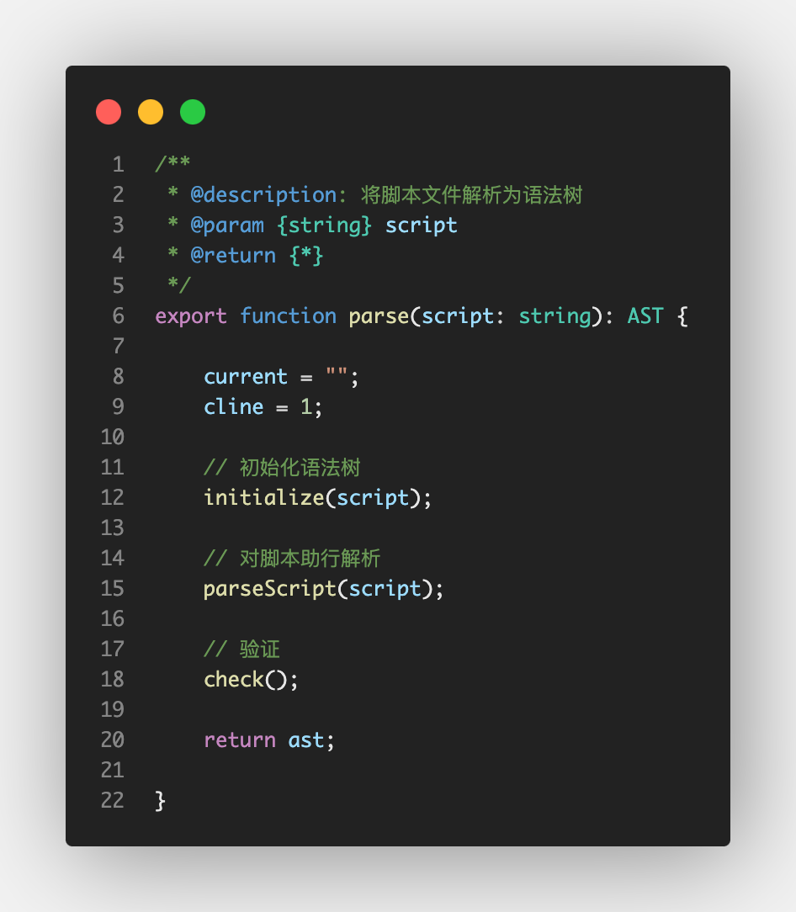

1. **初始化：**
   - `initialize` 函数用于初始化语法树 (`ast`)。在这里，它检查传入的脚本是否为字符串类型，如果不是则抛出类型错误。

2. **解析脚本：**
   - `parseScript` 函数将脚本逐行解析，并调用 `parseByLine` 函数来处理每一行的内容。

3. **解析行：**
   - `parseByLine` 函数解析每一行的内容，使用正则表达式替换字符串并调用 `parseToken` 函数来处理每个 token。

4. **解析 Token：**
   - `parseToken` 函数根据 token 的类型调用相应的解析函数，如 `parseStep`、`parseSay`、`parseListen` 等。

5. **解析 Step：**
   - `parseStep` 函数解析 `step` 类型的 token，存储当前步骤的信息，并将其添加到语法树中。

6. **解析 Say：**
   - `parseSay` 函数解析 `say` 类型的 token，处理字符串和变量，并将其添加到当前步骤的 `say` 属性中。

7. **解析 Listen：**
   - `parseListen` 函数解析 `listentimeout` 类型的 token，将超时限制添加到当前步骤的 `listen` 属性中。

8. **解析 Branch：**
   - `parseBranch` 函数解析 `branch` 类型的 token，处理用户回复和下一步的信息，并将其添加到当前步骤的 `branch` 属性中。

9. **解析 Silence：**
   - `parseSilence` 函数解析 `silenceaction` 类型的 token，将静默操作的信息添加到当前步骤的 `silence` 属性中。

10. **解析 Default：**
    - `parseDefault` 函数解析 `defaultaction` 类型的 token，将默认操作的信息添加到当前步骤的 `default` 属性中。

11. **解析 Exit：**
    - `parseExit` 函数解析 `exit` 类型的 token，将当前步骤的 ID 添加到退出步骤列表中。

12. **解析 Calculate：**
    - `parseCalculate` 函数解析 `calculate` 类型的 token，处理变量和计算操作，并将其添加到当前步骤的 `calculate` 属性中。

13. **验证：**
    - `check` 函数用于验证语法树的正确性，包括检查是否有至少一个步骤、至少一个退出步骤以及各个步骤的默认、静默、监听和分支是否有效。


#### <a name="28">2. translate.ts</a><a style="float:right;text-decoration:none;" href="#index">[Top]</a>


1. **获取变量：**
   - `getVari` 函数用于获取语法树中的变量信息。

2. **初始化：**
   - `init` 函数用于初始化对话状态，包括设置当前步骤为入口步骤 (`ast.entry`) 和传入的变量信息。

3. **执行脚本：**
   - `translate` 函数用于执行脚本。根据是否为初始步骤 (`enter`) 或静默状态 (`silence`)，执行相应的处理逻辑。
   - 处理入口步骤、静默操作、计算操作以及分支和默认操作。

4. **处理入口步骤：**
   - `processEntry` 函数用于处理入口步骤，包括处理 `say` 和 `listen` 操作。

5. **处理 Say 信息：**
   - `processSayInfo` 函数用于处理当前步骤中的 `say` 操作，将字符串和变量信息映射为消息。

6. **处理静默操作：**
   - `processSilence` 函数用于处理静默操作，根据 `silence` 和 `default` 属性切换到相应的步骤。

7. **处理计算操作：**
   - `processCalculate` 函数用于处理计算操作，根据表达式计算结果并更新变量，然后切换到下一个步骤。


### <a name="29">前端:</a><a style="float:right;text-decoration:none;" href="#index">[Top]</a>

#### <a name="30">1. 主界面: App.vue</a><a style="float:right;text-decoration:none;" href="#index">[Top]</a>


1. **模板部分：**
   - 使用了 Vue.js 的模板语法，定义了页面的结构。
   - 包含一个 `Chat` 组件，负责处理聊天窗口的显示。
   - 包含一些其他组件，如 `BottonDesign` 和 `TechTime`。
   - 提供了一个点击开始聊天的提示。

2. **脚本部分：**
   - 使用 TypeScript 编写脚本，引入了 Vue.js 的 `defineComponent` 函数。
   - 引入了 `Chat`、`BottonDesign` 和 `TechTime` 组件。
   - 设置了组件的名称为 "App"。

3. **样式部分：**
   - 使用了 SCSS 预处理器编写样式。
   - 设置了应用的背景图片、颜色等样式。
   - 包含一些 Chat 组件的样式调整，如聊天窗口的 z-index 设置。

4. **其他：**
   - 包含了一些特殊样式设置，如消息框的样式、头部样式等。
   - 在页面底部提供了一个点击开始聊天的提示，通过 CSS 动画设置了闪烁效果。

&emsp;这个模块主要目的是创建一个具有聊天机器人功能的 Web 应用。它通过 Vue.js 来管理组件和状态，使得页面结构、脚本和样式能够清晰地组织和交互。页面提供了一个友好的用户界面，包括聊天窗口和一些其他组件，同时通过动画提供了引导用户开始聊天的提示。整体上，这是一个用于展示聊天机器人的简单而精美的页面。

#### <a name="31">2. 按钮组件: Button.vue</a><a style="float:right;text-decoration:none;" href="#index">[Top]</a>
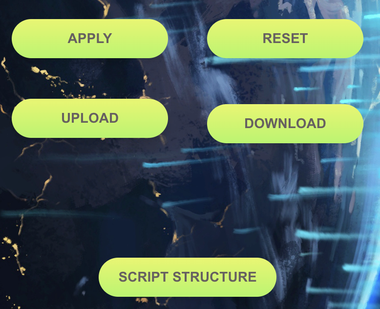
##### <a name="32">1. 模板部分：</a><a style="float:right;text-decoration:none;" href="#index">[Top]</a>
1. **Monaco Editor：** 使用Monaco Editor组件编辑Elixir脚本。
2. **动作按钮：**
   - **APPLY（应用）：** 应用当前脚本。
   - **RESET（重置）：** 将脚本重置为默认值。
   - **UPLOAD（上传）：** 允许用户上传自己的脚本文件。
   - **DOWNLOAD（下载）：** 提示用户提供名称并下载活动脚本。
   - **SCRIPT STRUCTURE（脚本结构）：** 显示脚本语法结构的按钮。

##### <a name="33">2. 脚本交互功能：</a><a style="float:right;text-decoration:none;" href="#index">[Top]</a>
- **脚本变化追踪：** 通过`ScriptChange`函数追踪脚本的变化。
- **应用按钮：** 通过`apply`函数将用户定义的脚本应用。
- **下载按钮：** 通过`download`函数下载脚本，提示用户提供脚本名称。
- **重置按钮：** 通过`reset`函数将脚本重置为默认值。
- **上传按钮：** 通过`uploadFile`函数处理上传的脚本文件。

##### <a name="34">3. 样式部分：</a><a style="float:right;text-decoration:none;" href="#index">[Top]</a>
- **样式定义：** 定义了一些样式，包括编辑器样式、按钮样式等。
- **动画效果：** 使用CSS关键帧动画为按钮添加了悬停时的动画效果。

- 使用了Element Plus库的提示框和消息框组件。
    - upload模块使用了el-upload组件
- 使用了Vue 3的`reactive`和`toRefs`来处理响应式数据。
- 使用了事件总线（`bus`）来共享数据，例如`defaultScript`和`activeScript`。

&emsp;这个组件提供了一个用户友好的界面，允许用户编辑、应用、重置、上传和下载脚本，并通过按钮点击查看脚本的语法结构。

#### <a name="35">3. 聊天框部分: ChatBox.vue</a><a style="float:right;text-decoration:none;" href="#index">[Top]</a>
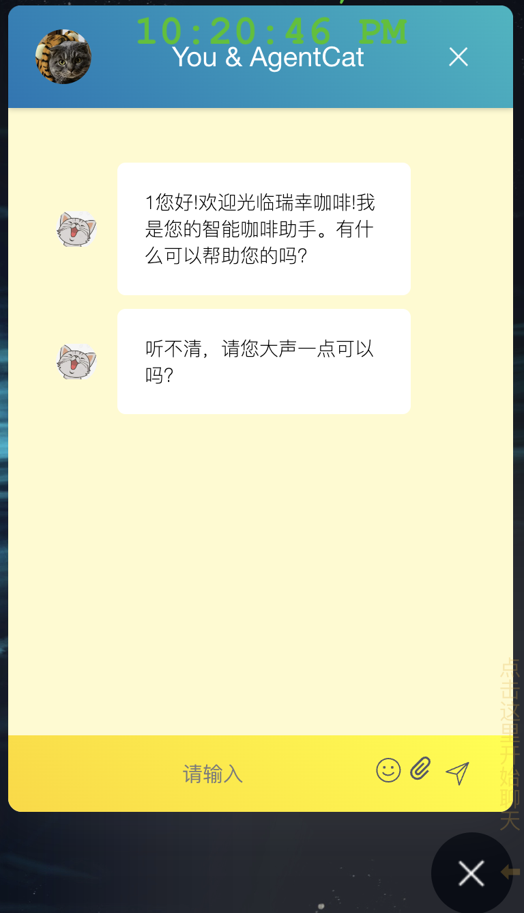
##### <a name="36">1. 模板部分：</a><a style="float:right;text-decoration:none;" href="#index">[Top]</a>
1. **UserList组件：** 用于显示用户列表。
2. **beautiful-chat组件：** 提供聊天框的界面和交互，包括消息显示、输入框、文件上传等。

##### <a name="37">2. 脚本交互功能：</a><a style="float:right;text-decoration:none;" href="#index">[Top]</a>
- **openChat函数：** 弹出对话框，要求用户输入用户名和初始化参数，然后初始化聊天。
- **initializeChat函数：** 初始化聊天，包括输入用户名、变量初始化，清空聊天消息列表，并将用户加入用户列表。
- **handleAnswer函数：** 处理用户的输入，翻译成机器人的回复，并显示在聊天框中。
- **AgentTalk函数：** 以“Service”身份向聊天框添加消息，用于模拟机器人的回复。
- **addMessage函数：** 将消息添加到聊天消息列表中，并调用AgentTalk函数生成机器人的回复。
- **AgentReply函数：** 根据用户输入获取机器人的回复，支持静默模式。
- **scheduleSilenceReply函数：** 根据给定的时间延迟，设置定时器，用于执行机器人的静默回复。
- **handleChatStop函数：** 处理聊天停止时的操作，包括禁用/启用输入框、更新用户信息和环境保存。

##### <a name="38">3. 数据和配置：</a><a style="float:right;text-decoration:none;" href="#index">[Top]</a>
- **DEFAULT_COLORS和DEFAULT_CHAT：** 默认的颜色和聊天配置。
- **bus.userList：** 用户列表的响应式数据。
- **chat：** 包含聊天框的状态、消息列表、打开/关闭状态等信息的响应式数据。

##### <a name="39">4. Watcher：</a><a style="float:right;text-decoration:none;" href="#index">[Top]</a>
- **watch(chat.stop, handleChatStop)：** 监听chat.stop的变化，触发handleChatStop函数。

- 使用Element Plus库的消息框和消息提示组件。
- 使用了自定义的翻译和状态处理工具函数。
- 使用了Vue 3的`reactive`和`toRefs`来处理响应式数据。

&emsp;这个组件提供了一个基于自然语言的聊天界面，用户可以与机器人进行交互，聊天过程中保存了用户和机器人的消息记录。

#### <a name="40">4. 动态时间模块: TechTime.vue</a><a style="float:right;text-decoration:none;" href="#index">[Top]</a>


##### <a name="41">1. 模板部分：</a><a style="float:right;text-decoration:none;" href="#index">[Top]</a>
1. `<div class="date">{{ currentDate }}</div>`: 显示当前日期的部分。
2. `<div class="time">{{ currentTime }}</div>`: 显示当前时间的部分。

##### <a name="42">2. 脚本部分：</a><a style="float:right;text-decoration:none;" href="#index">[Top]</a>
- `setup()`函数中：
  - `currentDate`和`currentTime`是用于显示日期和时间的响应式变量。
  - `updateDate`函数用于更新日期，使用`toLocaleDateString`方法获取本地日期字符串。
  - `updateTime`函数用于更新时间，使用`toLocaleTimeString`方法获取本地时间字符串。
  - `onMounted`生命周期钩子在组件挂载后执行，调用`updateDate`和`updateTime`更新日期和时间，并通过`setInterval`每秒更新一次时间。

##### <a name="43">3. 样式部分：</a><a style="float:right;text-decoration:none;" href="#index">[Top]</a>
- 样式规定了时钟模块的位置、字体大小、颜色等。
- `.tech-time`类规定了时钟模块的整体样式，包括绝对定位、字体大小、颜色等。
- `.time`类规定了时间部分的样式，并添加了一个名为`pulse`的关键帧动画，使时间在缩放时产生脉动效果。

##### <a name="44">4. 关键帧动画：</a><a style="float:right;text-decoration:none;" href="#index">[Top]</a>
- `@keyframes pulse`: 定义了一个名为`pulse`的关键帧动画。
  - 在动画的0%、50%、和100%处，通过`transform: scale`属性控制时间的缩放，产生脉动效果。
  - 使用`animation`属性将动画应用于时间部分，并设置为1秒的持续时间、缓动函数为`ease-in-out`，并无限循环。


- 使用Vue 3的`ref`和`onMounted`来处理响应式数据和生命周期钩子。
- 样式中的`scoped`关键字表示这些样式只在当前组件中起作用。

&emsp;这个组件通过Vue.js实现了一个简单的时钟模块，提供了显示日期和时间的功能，并通过CSS动画为时间部分添加了脉动效果。

#### <a name="45">5. 用户列表模块: UserList.vue</a><a style="float:right;text-decoration:none;" href="#index">[Top]</a>

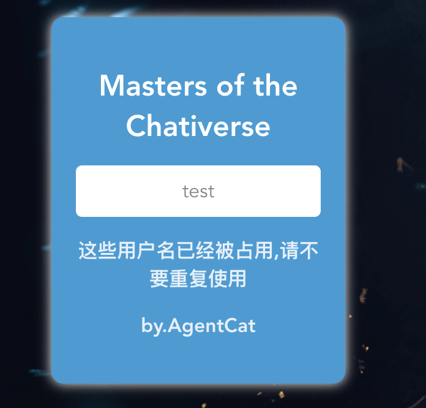

##### <a name="46">1. 模板部分：</a><a style="float:right;text-decoration:none;" href="#index">[Top]</a>
1. `<h2 class="tech-title">Masters of the Chativerse</h2>`: 显示一个标题，表示聊天室的用户列表。
2. `<ul class="user-list">`: 用于显示用户列表的无序列表。
3. `<li v-for="(user, username) in users" :key="username" class="user-item">{{ username }}</li>`: 遍历`users`对象，显示每个用户的用户名。

##### <a name="47">2. 脚本部分：</a><a style="float:right;text-decoration:none;" href="#index">[Top]</a>
- `props: { users: Object }`: 定义了一个名为`users`的属性，用于接收父组件传递的在线用户列表。

##### <a name="48">3. 样式部分：</a><a style="float:right;text-decoration:none;" href="#index">[Top]</a>
- `.user-list-container`: 用户列表的容器样式，包括背景颜色、边框半径、阴影、宽度等。
- `.tech-title`: 用户列表标题的样式，包括字体大小、字体家族、文字颜色等。
- `.user-list`: 用户列表的样式，包括去除列表样式、内外边距为0。
- `.user-item`: 单个用户项的样式，包括内外边距、文字颜色、背景颜色、边框半径、字体家族、光标样式等。添加了颜色和背景色的过渡效果。

- 使用了Vue.js的`v-for`指令遍历`users`对象中的每个用户。
- 使用了Vue.js的`props`属性接收父组件传递的在线用户列表。
- 样式中的`scoped`关键字表示这些样式只在当前组件中起作用。
- 提供了一个警告信息，说明这些用户名已经被占用，请不要重复使用，由AgentCat提供。

&emsp;这个组件提供了一个简单的用户列表显示，包含在线用户的用户名，并通过样式和标题进行装饰。


# <a name="49">七. 测试桩与测试脚本:</a><a style="float:right;text-decoration:none;" href="#index">[Top]</a>
&emsp;本项目使用 Jest 测试框架，对于 parse 和 translate 两个模块进行单元测试，总共设计了44个测试项目,覆盖了所有的语句、分支、函数和代码行，保证了测试的正确性和完备性。

&emsp;在测试阶段，Jest框架发挥了测试桩的关键作用，能够模拟生成AST语法树和用户输入。这使得我们能够独立地对parse和translate两个模块进行单元测试，而无需考虑它们之间的相互依赖关系。

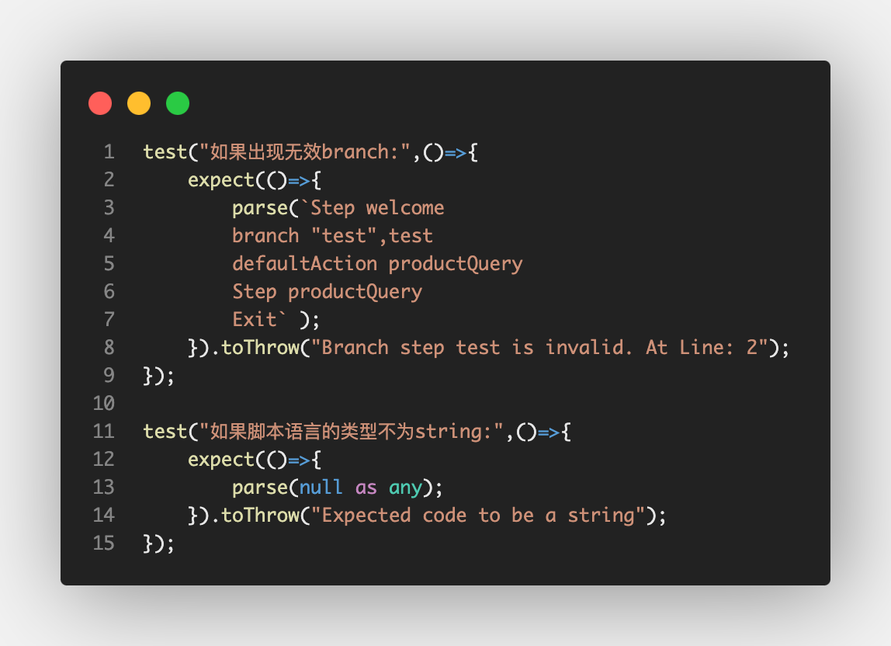
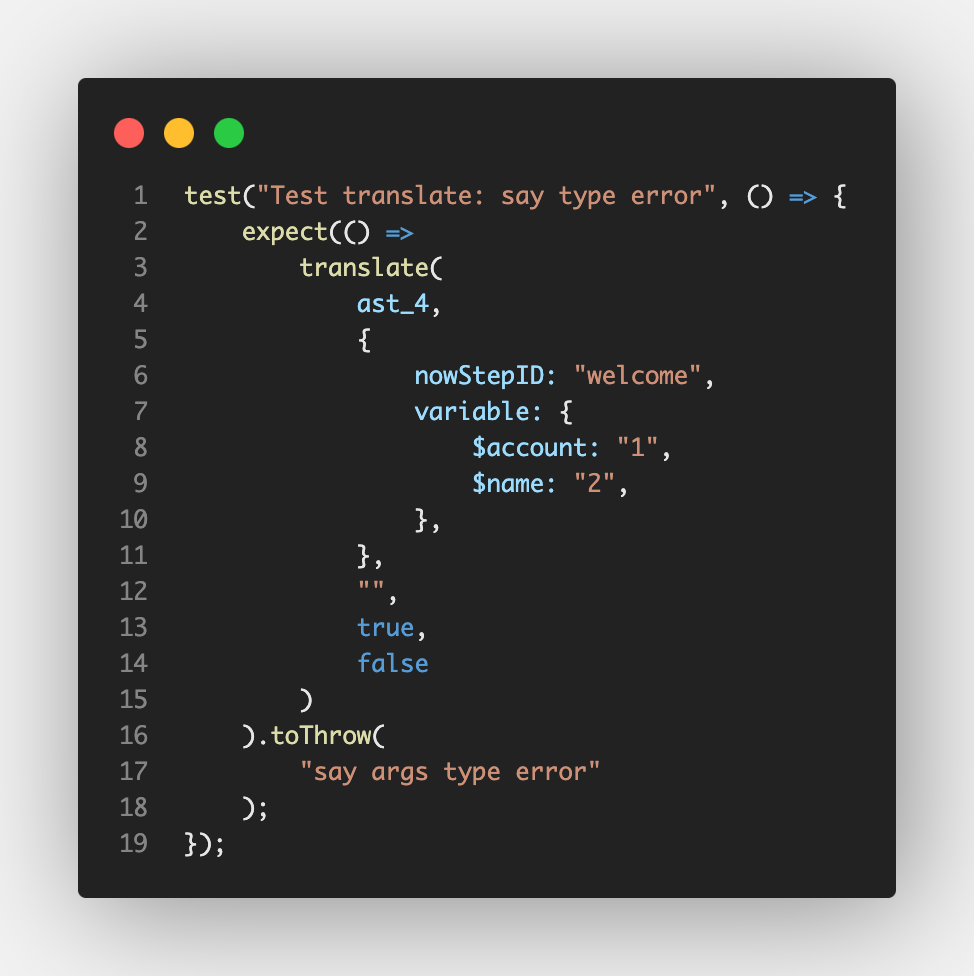

&emsp;Jest的测试脚本具有高度自动化，只需运行 `npm run test` 命令即可触发自动化测试流程，并在完成后输出详细的测试结果。这为开发人员提供了便捷的方式来验证代码的正确性，同时节省了手动测试的时间和精力。

&emsp;通过Jest的测试桩function，我们能够模拟各种场景，包括生成AST和用户输入的不同情况，以确保代码在各种情境下都能正确执行。这种测试方法有助于发现潜在的问题并提高代码的质量。

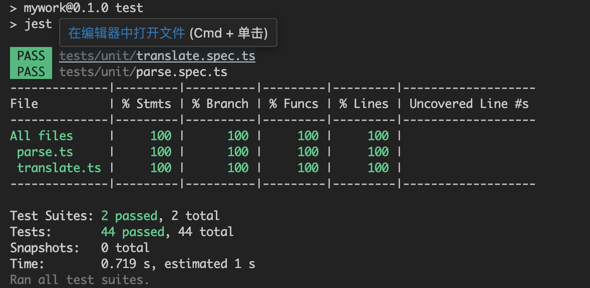
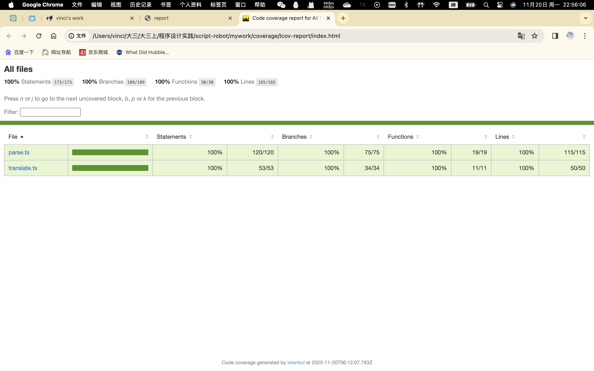
# <a name="50">八. 效果展示:</a><a style="float:right;text-decoration:none;" href="#index">[Top]</a>

**网页主页面:**


- 点击apply:应用当前输入框/用户恢复默认的脚本
- 点击reset:重置脚本为默认脚本
  
**点击upload:** 用户可以自己上传脚本:
  
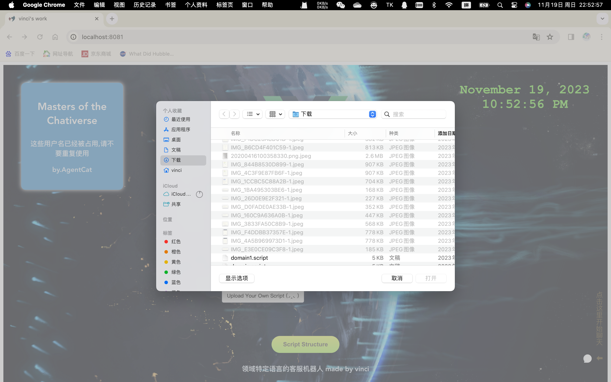

**点击Script Structure:**

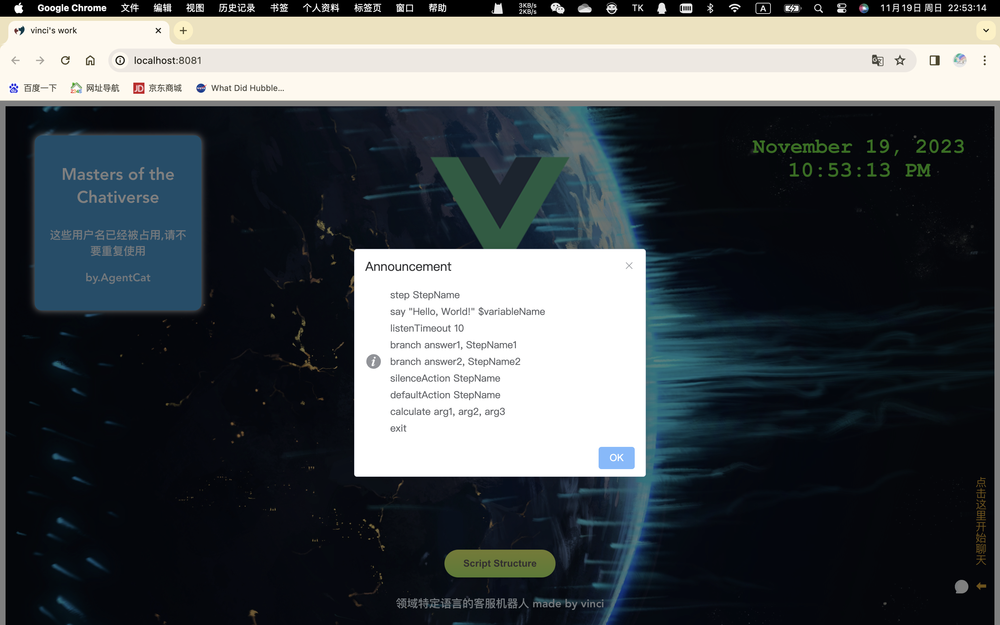

**点击download:** 用户可以下载当前生效的脚本:
  
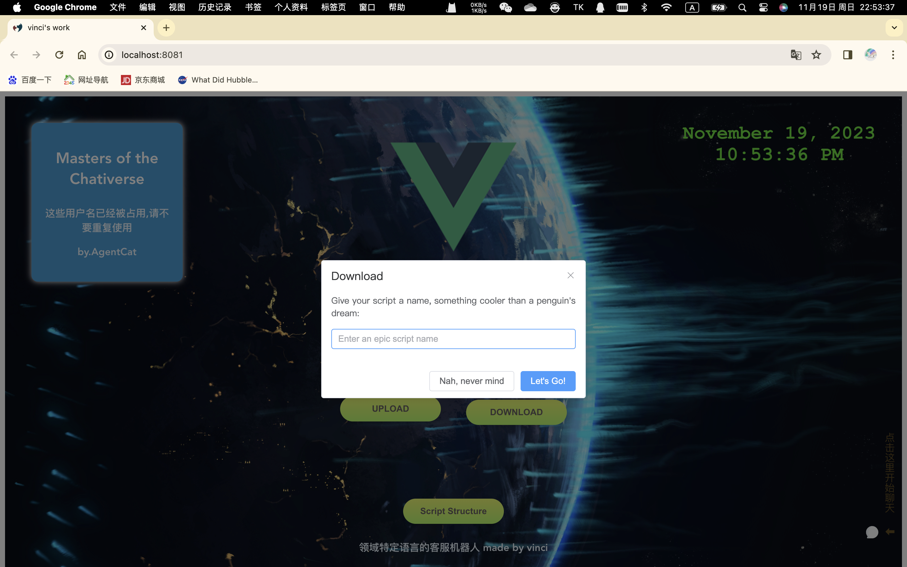

**点击开启聊天:** 
  - 用户可以输入姓名

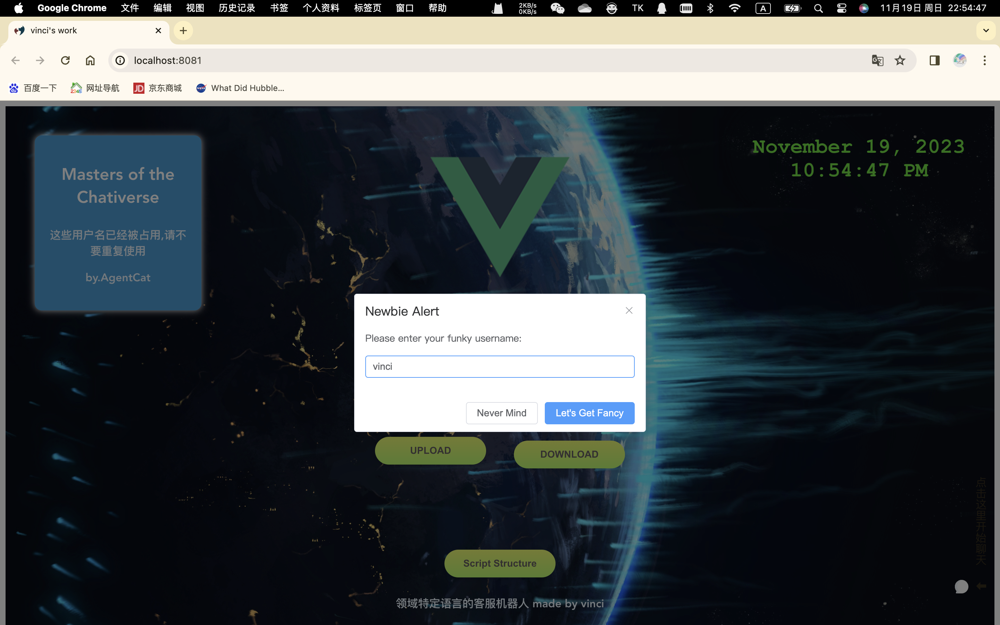

  - 此时用户列表部分会显示用户姓名,用户姓名不可以重复使用


- 用户输入姓名以及账户余额供脚本使用

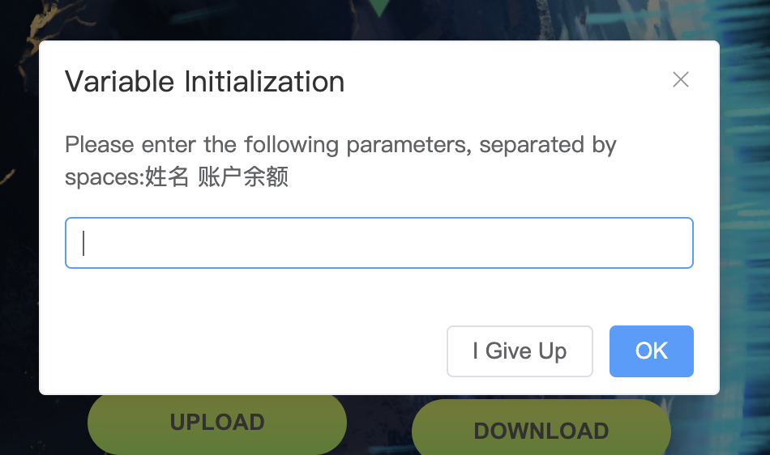

- 此时用户可以与客服对话:

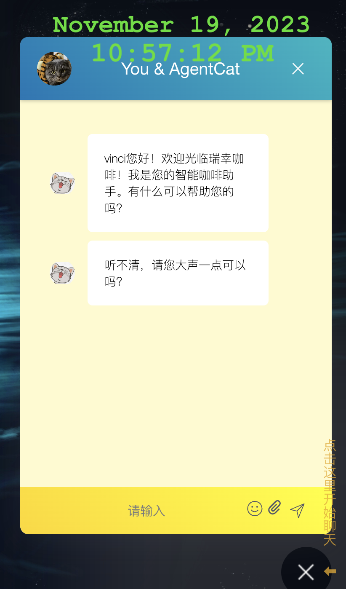

**我选用的默认脚本是:**
```text
step welcome 
    say $name+"您好！欢迎光临瑞幸咖啡！我是您的智能咖啡助手。有什么可以帮助您的吗?"
    listenTimeout 5
    branch "查询咖啡种类和价格", productQuery
    branch "下订单", placeOrder
    branch "查询订单状态", orderStatusQuery
    branch "店铺信息", storeInfo
    branch "投诉与建议", feedback
    branch "常见问题解答", faq
    branch "退出", exit
    silenceAction silence
    defaultAction default
    
step productQuery 
    say "想了解我们的咖啡种类和价格吗？我们提供的咖啡有: 马斯卡彭生酪拿铁 18元/杯、生椰拿铁 18元/杯、酱香拿铁 19元/杯、圣诞烤布丁拿铁 21元/杯、太妃真香厚乳拿铁 19元/杯。"
    branch "了解更多", faq
    branch "我想下订单", placeOrder
    defaultAction default
step placeOrder 
    say "如果您想订购咖啡，只需告诉我您想要的产品的价格.我将为您计算您的账户余额.您当前的余额为:"+$account #comment
    Calculate $account,afterPlaceOrder,$account - INPUT #comment

step afterPlaceOrder 
    say "购买成功,您的账户余额为:"+ $account + "请问您还有什么需求吗?"
    listenTimeout 5
    branch "查询咖啡种类和价格", productQuery
    branch "下订单", placeOrder
    branch "查询订单状态", orderStatusQuery
    branch "店铺信息", storeInfo
    branch "投诉与建议", feedback
    branch "常见问题解答", faq
    branch "退出", exit
    silenceAction silence
    defaultAction default

step orderStatusQuery 
    say "您的订单正在制作中,请稍等"
    listenTimeout 5
    branch "查询咖啡种类和价格", productQuery
    branch "下订单", placeOrder
    branch "查询订单状态", orderStatusQuery
    branch "店铺信息", storeInfo
    branch "投诉与建议", feedback
    branch "常见问题解答", faq
    branch "退出", exit
    silenceAction silence
    defaultAction default

step storeInfo 
    say "需要了解附近店铺的位置和营业时间吗？告诉我您所在的城市，我会为您提供相关信息。"
    branch "瑞幸咖啡的营业时间是多久", businessHours
    defaultAction default

step businessHours
    say "瑞幸咖啡的营业时间可能因地区而异。通常，我们的店铺在早上8点至晚上10点之间营业。"
    listenTimeout 5
    branch "查询咖啡种类和价格", productQuery
    branch "下订单", placeOrder
    branch "查询订单状态", orderStatusQuery
    branch "店铺信息", storeInfo
    branch "投诉与建议", feedback
    branch "常见问题解答", faq
    branch "退出", exit
    silenceAction silence
    defaultAction default

step feedback 
    say "如果您有任何投诉或建议，我们非常重视。请告诉我您的问题，我将尽力帮助您或转接您至相关部门。"
    defaultAction feedbackFinish

step feedbackFinish
    say "好了，你的投诉已经牢牢地被我记在小本本上了。请问还有什么可以帮到您的?"
    listenTimeout 5
    branch "查询咖啡种类和价格", productQuery
    branch "下订单", placeOrder
    branch "查询订单状态", orderStatusQuery
    branch "店铺信息", storeInfo
    branch "投诉与建议", feedback
    branch "常见问题解答", faq
    branch "退出", exit
    silenceAction silence
    defaultAction default

step faq 
    say "有关账户、支付、配送等方面的常见问题，您可以直接问我，我会提供尽可能详细的解答。比如,您可以问我:如何创建账户、支付方式有哪些、配送服务说明"
    branch "如何创建账户", accountCreation
    branch "支付方式有哪些", paymentMethods
    branch "配送服务说明", deliveryDetails
    defaultAction default

step accountCreation
    say "要创建瑞幸咖啡账户，您可以访问我们的官方网站或使用我们的移动应用。在注册过程中，您需要提供一些基本信息，如电子邮件地址和密码。完成注册后，您就可以享受更多会员福利了。"
    listenTimeout 5
    branch "查询咖啡种类和价格", productQuery
    branch "下订单", placeOrder
    branch "查询订单状态", orderStatusQuery
    branch "店铺信息", storeInfo
    branch "投诉与建议", feedback
    branch "常见问题解答", faq
    branch "退出", exit
    silenceAction silence
    defaultAction default

step paymentMethods
    say "我们接受多种支付方式，包括信用卡、支付宝和微信支付。您可以在下单时选择最方便的支付方式完成交易。"
    listenTimeout 5
    branch "查询咖啡种类和价格", productQuery
    branch "下订单", placeOrder
    branch "查询订单状态", orderStatusQuery
    branch "店铺信息", storeInfo
    branch "投诉与建议", feedback
    branch "常见问题解答", faq
    branch "退出", exit
    silenceAction silence
    defaultAction default

step deliveryDetails
    say "我们提供快捷可靠的配送服务。配送时间和费用可能会根据您所在的地区而有所不同。在结账时，您可以查看详细的配送选项和费用信息。如果有特殊要求，请告诉我，我们将尽力满足您的需求。"
    branch "查询咖啡种类和价格", productQuery
    branch "下订单", placeOrder
    branch "查询订单状态", orderStatusQuery
    branch "店铺信息", storeInfo
    branch "投诉与建议", feedback
    branch "常见问题解答", faq
    branch "退出", exit
    silenceAction silence
    defaultAction default

step exit 
    say "感谢您选择瑞幸咖啡！再见。"
    exit

step silence 
    say "听不清，请您大声一点可以吗?"
    branch "查询咖啡种类和价格", productQuery
    branch "下订单", placeOrder
    branch "查询订单状态", orderStatusQuery
    branch "店铺信息", storeInfo
    branch "投诉与建议", feedback
    branch "常见问题解答", faq
    branch "退出", exit
    defaultAction default

step default 
    say "抱歉，我不明白你的意思."
    listenTimeout 5
    branch "查询咖啡种类和价格", productQuery
    branch "下订单", placeOrder
    branch "查询订单状态", orderStatusQuery
    branch "店铺信息", storeInfo
    branch "投诉与建议", feedback
    branch "常见问题解答", faq
    branch "退出", exit
    silenceAction silence
    defaultAction default
```
**测试脚本对话部分:**
  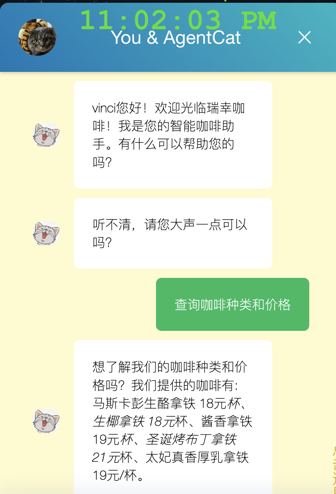
  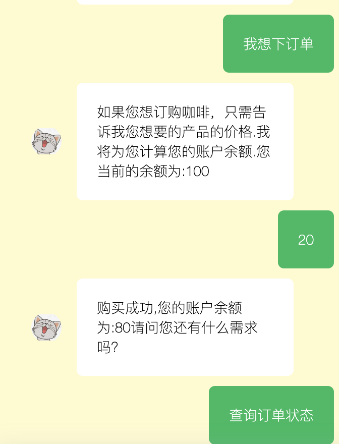
  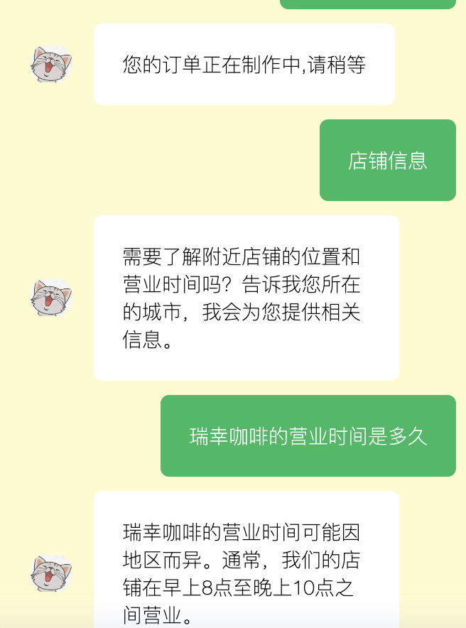
  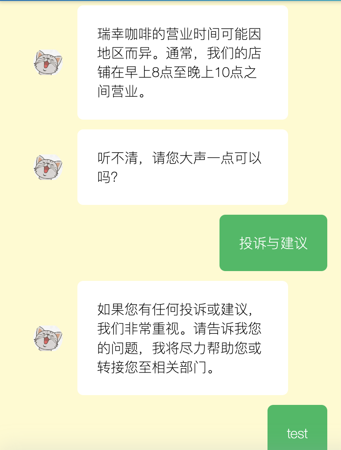
  
  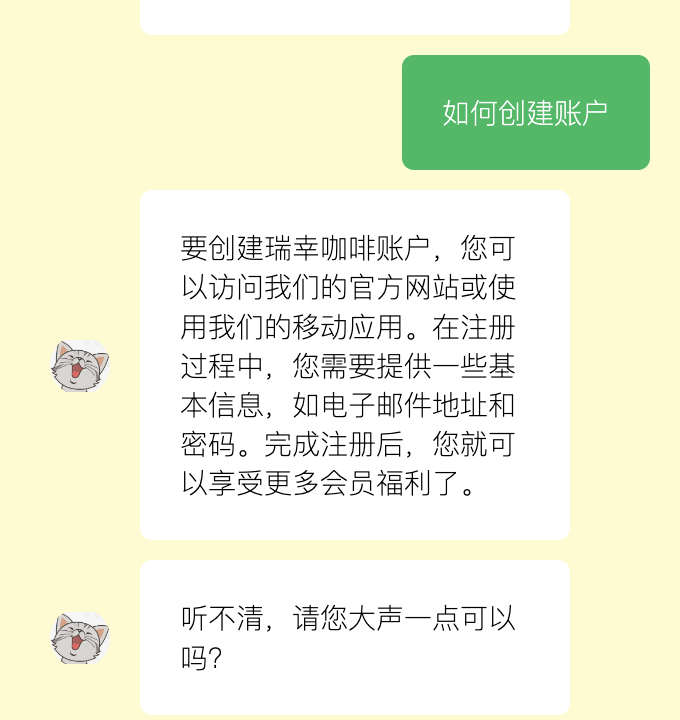
  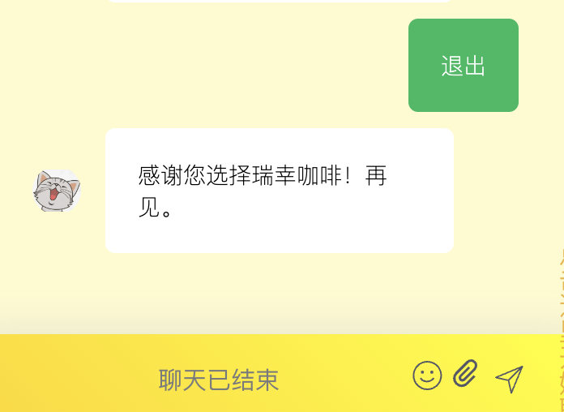